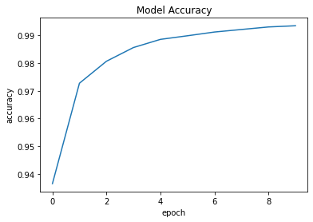
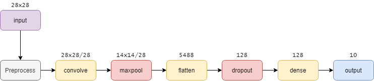

# Numeric Identifier

The number identifier using the MNIST dataset is the first neural network that many machine learning developer comes across. The components of this algorithm is very straightforward, comprised of 4 stages: building, training, prediction, and evaluation. Given a particular index selection, the model will predict the most likely identity of the images and a visual output of the actual image for comparison.

## Usage
#### Jupyter notebook
1. Open `NumericIdentifier.ipynb` using [Google Colab](colab.research.google.com)
2. Modify the index value in the `Test Model` section
	a. Notice whether the displayed image is similar to the number outputted
>This method means that you do not have to install anything

#### Local Command Line
1.  Change the working directory to the `NumericIdentifier`folder
	a. `cd   %path%\NumericIdentifier`
4. Make sure you have the necessary files installed
	a. [Python3](https://www.python.org/download/releases/3.0/)
	b. [Tensorflow](https://www.tensorflow.org/install/pip)
	c. [MatplotLib](https://pypi.org/project/matplotlib/)
5.  Run `NumericIdentifier.py`
a. `python NumericIdentifer.py`
> This program will by default display the datapoint index of 60, which is a '7'

### Output
A training that shows the accuracy improvement over the training iterations should look like the following:

    

The final output of the program using the index of 60 should be 

    

## Components
A **Neural Network** describes a type of machine learning model that includes at least one hidden layer of neurons. In this model, there are 2 hidden layers that are used to "re-organise" information to find useful patterns that can be used to determine which of the 10 possible outcomes it is. A structural representation of the neural network model can be seen in the following figure:

    

The **2D Convolution** is a fundamental process in many image processing ML algorithms. Visually, it finds a weight to assign each pixel within a prescribed window (3x3 in this case), records this and then moves on until it has translated every pixel in the image. This process is repeated to create multiple versions known as *filters*. These filters will go on filter out the less significant information, and help the final 10 nodes decide which of the possible outputs should be chosen.

